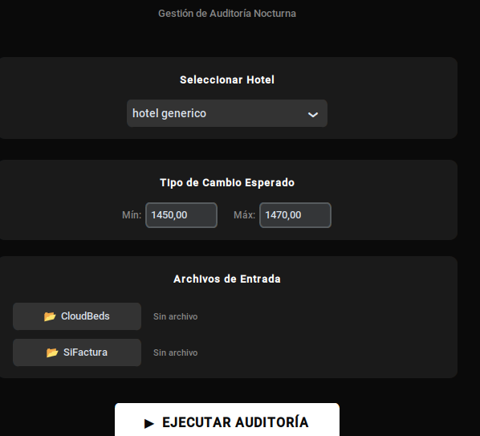
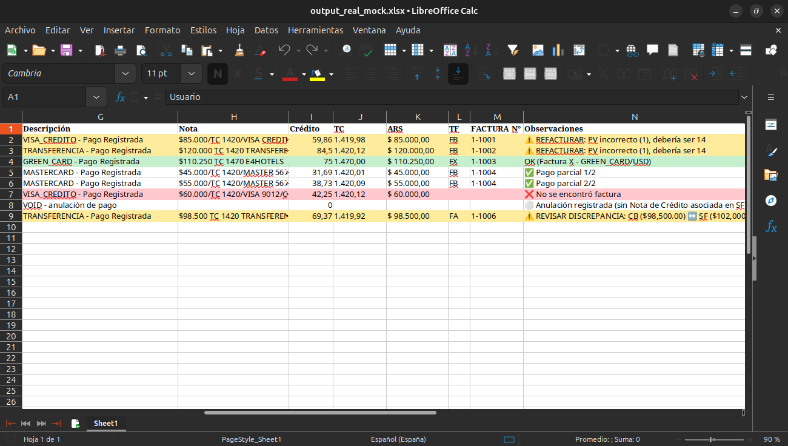

# 🏨 Sistema ETL de Auditoría Financiera Hotelera: Cloudbeds ↔ SiFactura

Un motor de procesamiento de datos y conciliación automática diseñado para resolver el cuello de botella más crítico de la auditoría nocturna: cruzar cientos de transacciones diarias entre un PMS (Cloudbeds) y un sistema de facturación fiscal (SiFactura/AFIP) eliminando el error humano.

> **Impacto Comercial:** Transforma una tarea manual de 45+ minutos propensa a errores en un proceso infalible que se ejecuta en **0.30 segundos**.

---

## 🚀 El Problema vs. La Solución

**El Problema:**
La conciliación manual exige cruzar múltiples bases de datos desestructuradas a la madrugada. Los sistemas no se hablan entre sí, y los humanos deben detectar pagos parciales, diferencias por tipo de cambio, retenciones fiscales y errores de tipeo, línea por línea.

**La Solución (AUDIBOT):**
Un sistema desarrollado en Python que ingesta los reportes crudos, normaliza los datos y aplica un algoritmo de *matching* complejo. Genera un reporte final en Excel, semaforizado por colores, destacando exactamente dónde requiere intervención el auditor.

---

## 📊 Métricas de Rendimiento y Volumen

El sistema está optimizado para entornos de alta exigencia operativa, testeado en producción en un hotel céntrico de Buenos Aires:

*   **Volumen de Datos:** Procesa entre **90 y 170 registros diarios complejos** (30-70 imputaciones vs. 60-100 facturas fiscales).
*   **Velocidad de Ejecución (Producción):** **0.30 segundos** en el equipo de recepción.
*   **Eficiencia Multiplataforma:** Arquitectura de bajo consumo de recursos (0.44s en entornos Linux portátiles, 0.99s en Windows).

---

## ⚙️ Complejidad Operativa Resuelta

El algoritmo no hace un simple cruce de "montos iguales". Está programado para entender las **reglas de negocio** reales de la industria hotelera y fiscal:

*   **Pagos Parciales y Complejos:** Detecta *N* transacciones de Cloudbeds que sumadas equivalen a una única factura en SiFactura.
*   **Inteligencia Fiscal:** Identifica y concilia retenciones impositivas de Argentina (IIBB, Ganancias, SUSS, IVA) y diferencia lógicas de matching según el tipo de comprobante (Facturas A, B, T, X).
*   **Anulaciones LIFO:** Detecta operaciones de pago y anulación ocurridas en la misma jornada para excluirlas del reporte de discrepancias.
*   **Conversión Multimoneda:** Función `GREEN_CARD` integrada para la conversión automática de pagos en USD a ARS según el tipo de cambio dinámico ingresado.

---

## 🖥️ Interfaz

---

## 📋 Reporte de Salida

El resultado es un Excel semaforizado donde cada fila indica exactamente qué acción debe tomar el auditor:

---

## 🛠️ Arquitectura y Tecnologías

El proyecto fue construido con un enfoque modular y escalable, permitiendo agregar nuevas lógicas de facturación o puntos de venta (hoteles) simplemente editando un archivo JSON de configuración.

*   **Lenguaje Base:** Python 3.12+
*   **Interfaz Gráfica (GUI):** CustomTkinter (Entry point amigable para el usuario final sin conocimientos de consola).
*   **Procesamiento de Datos:** Lógica custom de parseo (`core/parsers.py`) y algoritmos de coincidencia (`core/matchers.py`).
*   **Observabilidad:** Sistema de *Logging* encapsulado con generación automática de metadatos y hashes SHA256 por cada ejecución para trazabilidad y soporte técnico.
*   **Distribución:** Ejecutables compilados nativamente vía PyInstaller para Linux (`.sh`) y Windows (`.bat`).

---

## 📁 Archivos de Muestra

La carpeta [`samples/`](samples/) contiene datos ficticios que ilustran exactamente qué entra y qué sale del sistema:

| Archivo | Descripción |
|---|---|
| `input_cloudbeds_mock.xlsx` | Exportación simulada del PMS (pagos, reservas, habitaciones) |
| `input_sifactura_mock.xlsx` | Listado de facturas fiscales simulado (AFIP/SiFactura) |
| `output_auditoria_mock.xlsx` | Reporte final generado por AUDIBOT, semaforizado por colores |

El output incluye ejemplos de todos los escenarios que el algoritmo resuelve: matches exactos, pagos divididos en múltiples transacciones, conversión USD→ARS vía GREEN_CARD, anulaciones LIFO y discrepancias pendientes de revisión.

---

## 📬 Contacto

¿Tenés un flujo operativo que querés automatizar? Puedo desarrollar una solución similar para tu negocio.

*   **LinkedIn:** [Sebastián González](https://www.linkedin.com/in/sebasti%C3%A1n-gonz%C3%A1lez-571a18195/)
*   **Email:** [sebag2298@gmail.com](mailto:sebag2298@gmail.com)
