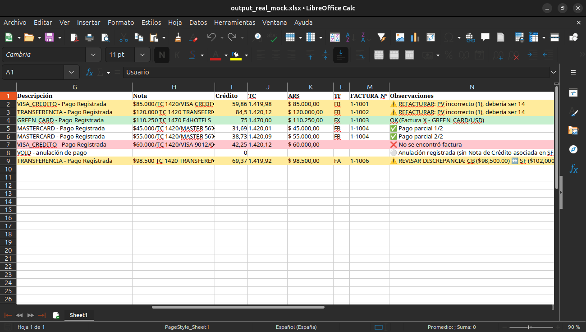

# 🏨 AUDIBOT — Hotel Financial Audit ETL: Cloudbeds ↔ SiFactura

    

A data-processing and automatic reconciliation engine that solves the most critical bottleneck in night auditing: cross-referencing hundreds of daily transactions between a PMS (**Cloudbeds**) and a fiscal billing system (**SiFactura/AFIP**), while eliminating human error.

> **In production at a Buenos Aires hotel chain (11 properties)**, rolled out site by site since 2026 and used by night auditors on real fiscal data. Licensed to the client under a signed agreement that formally acknowledges authorship.

> **Impact:** replaces the manual reconciliation of each night audit. A full day of transactions is processed in **under a second**; the auditor only reads the rows that need action.

---

## 🚀 The Problem vs. The Solution

**The Problem:**
Manual reconciliation requires cross-referencing multiple unstructured databases in the middle of the night. The systems don't communicate with each other, and humans must detect partial payments, exchange rate differences, tax withholdings, and typos — line by line.

**The Solution (AUDIBOT):**
A Python desktop app that ingests the raw reports, normalizes the data, and applies a complex matching algorithm. It generates a final color-coded Excel report highlighting exactly where the auditor needs to intervene — nothing else.

| Color | Meaning |
|---|---|
| 🟢 Green | Correct match |
| 🟡 Yellow | Review / fix (payment-method change, re-invoice, etc.) |
| 🔴 Red | No match / detected error |
| ⚪ Gray | Intentionally excluded (voids with credit note, pending Mercado Pago, current account) |

---

## 🆕 What's new since the first pilot (v4.10.x, 41 public releases)

The engine grew from 84 to **1,025 automated tests** and matured from a matching script into a maintained desktop product:

- **New automatic detections** (see below), every one of them surfaced from a real production audit and shipped with its regression case.
- **Regression suite on anonymized real cases** plus a **golden master** of the engine's output, run as a gate before each release: a change that moves a single cell of any historical report is caught before it ships.
- **Built-in auto-update** — the app checks for new public releases and updates itself, so every property runs the same current version.
- **Irreversible data anonymization** for support bundles (GDPR / EDPB-aligned) — see *Data Handling* below.
- **Integrated support flow** — one-click support package delivered to the developer, with graceful offline degradation.
- **Per-run observability** — every execution leaves a traceable run folder (inputs, logs, SHA256 hashes).
- **Cross-platform native builds** — Windows `.exe` and Linux binaries via PyInstaller.

---

## ⚙️ Operational Complexity Resolved

The algorithm doesn't do a naive "equal amounts" match. It encodes the real **business rules** of the hotel and fiscal industry:

- **Partial & complex payments:** detects *N* Cloudbeds transactions that, summed, equal a single SiFactura invoice.
- **Fiscal intelligence:** reconciles Argentine tax withholdings (IIBB, Ganancias, SUSS, VAT) and applies differentiated logic per invoice type (A, B, T, X).
- **LIFO voids:** detects payment + void on the same business day and excludes them from the discrepancy report.
- **Multi-currency:** `GREEN_CARD` function converts USD → ARS at the day's exchange rate.
- **Duplicate coupons:** same card charged twice.
- 🆕 **Invoices with no customer loaded** — flags SiFactura invoices left with an empty client field before fiscal close.
- 🆕 **Orphan FT/FX invoices of the same guest** — catches a foreign-platform charge invoiced as if it were domestic.
- 🆕 **Fiscal invoices with no matching Cloudbeds payment** — every invoice in range must have a counterpart.
- 🆕 **Mercado Pago imputed to the wrong point of sale** — separates the false positive from the real POS problem.
- 🆕 **USD × exchange-rate ≠ ARS coherence** — a peso invoice that doesn't close against a dollar payment at the day's rate; when the note's amount is corrupt, the invoice is recovered through the reservation instead of being lost.
- 🆕 **Refunds and voids paired with their credit notes** — including the "void and re-post" procedure, which used to be punished as an error.
- 🆕 **Incomplete re-invoicing** — an orphan invoice whose amount was absorbed into another one.
- 🆕 **Payment method contradicted by the note** — the row says card, the note says cash.
- 🆕 **Note amount cross-checked against the USD amount** at the declared exchange rate, so the order in which the receptionist writes the note no longer matters.
- 🆕 **Current-account charges matched to their invoice** when it already exists, instead of being set aside for month-end billing.

---

## 🔐 Data Handling & Privacy

AUDIBOT runs on **real guest and fiscal data**, so privacy is built in, not bolted on:

- **Irreversible anonymization** (`core/anonimizador.py`): before any support bundle leaves the front-desk machine, guest names, amounts and fiscal identifiers are stripped — **no opt-out**.
- Backed by an internal **EDPB compliance checklist**, a **data-retention policy**, and a DPA template.
- Support data that becomes a regression case never reaches the repository un-anonymized.

---

## 🖥️ Interface & Output

The result is a color-coded Excel where each row states exactly what the auditor must do:

---

## 🛠️ Architecture & Technologies

Modular, testable, and built to add new billing logic or properties by editing configuration — not code.

- **Core language:** Python 3.12+
- **GUI:** CustomTkinter (no console knowledge required)
- **Matching engine:** `core/matchers/` — a dedicated package split into reusable primitives, detectors, a row-by-row pipeline, and block processors.
- **Parsing:** `core/parsers.py` (amounts, payment methods, DD/MM/YYYY dates) with fiscal guardrails.
- **Adapter layer:** pluggable data sources (`adapters/`) — currently Excel/HTML exports, designed toward direct API integration.
- **Auto-update & support:** `gui/updater.py` (release checks), `gui/soporte.py` + `gui/telegram.py` (support bundles).
- **Observability:** per-run folders under `~/Documents/AUDIBOT/RUNS/` with logs and SHA256 hashes for traceability.
- **Distribution:** natively compiled executables via PyInstaller (Linux + Windows).

---

## ✅ Test Suite

**1,025 passing tests** cover the matching engine end-to-end, plus a regression catalogue of anonymized real support bundles and a golden master of the engine's output:

- The matching core (`core/matchers/`): duplicate detection, anti-crossmatch, business exclusions (Mercado Pago, voids).
- Parsers: ARS extraction across multiple note formats, fiscal guardrail, payment-method mapping.
- Utilities: name normalization, fuzzy similarity, exchange-rate math, amount parsing.
- Every detector, each with its own regression scenarios taken from the production case that motivated it.

Key invariants validated:
- **Anti-crossmatch:** guests with different names but matching amounts are never incorrectly linked.
- **dtype safety:** handles Cloudbeds dtype inconsistencies (string reservation numbers, etc.) without crashing.
- **Fiscal guardrail:** exchange-rate values are never misread as ARS amounts.

---

## 📁 Sample Files

The [`samples/`](samples/) folder contains **fictional** data illustrating exactly what goes in and out of the system:

| File | Description |
|---|---|
| `input_cloudbeds_mock.xlsx` | Simulated PMS export (payments, reservations, rooms) |
| `input_sifactura_mock.xlsx` | Simulated fiscal invoice list (AFIP/SiFactura) |
| `output_auditoria_mock.xlsx` | Final color-coded report generated by AUDIBOT |

The output includes every scenario the algorithm handles: exact matches, split payments, USD→ARS conversion, LIFO voids, and discrepancies pending review.

---

## 📬 Contact

Do you have an operational workflow you want to automate? I can develop a similar solution for your business.

*   **LinkedIn:** [Sebastián González](https://www.linkedin.com/in/sebastian-gonzalez-it)
*   **Email:** [sebag2298@gmail.com](mailto:sebag2298@gmail.com)
